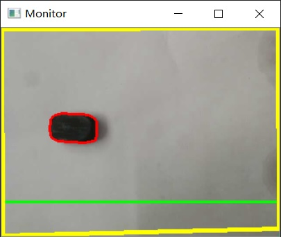
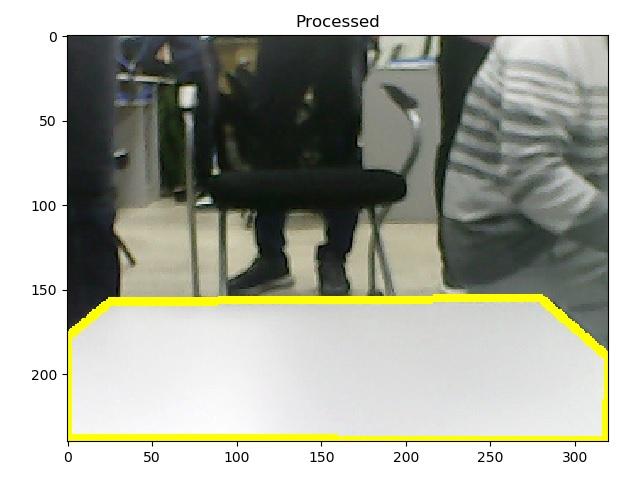
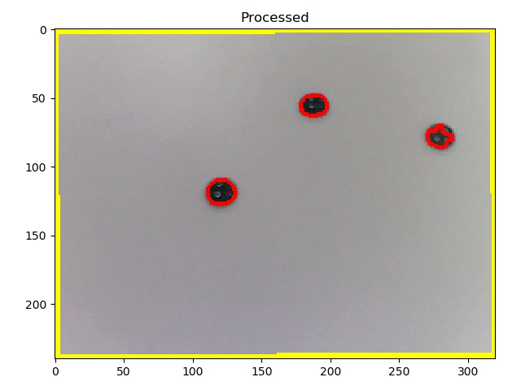
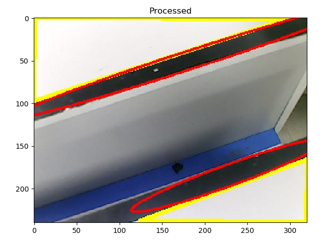

# robot vision
This repository contains the **vision part**, which is also what I mainly contributed to, of the robot project of "_Intelligent Robots Design and Implementation_" course of E.E, Tsinghua University. It used non-deep learning methods of object detection.

I created this standalone project because this vision module was designed to be **test-friendly**, **extensible** and **independent** from the other code of the robot project. Also, after seeing some of my classmates struggling with their code because of poor abstraction, messy structure and unfamiliarity with OpenCV, I wanted to share my solution and also help students who take this course later quickly get started with the course project.

You can view the whole project at [RainEggplant/robot-terror-drone](https://github.com/RainEggplant/robot-terror-drone) if interested. However, I DO NOT recommend using this project directly ...

## Features
### Real-time monitor and output for debug


Console output:
```
possible track: area 76027.5, solidity 0.9976183915285596, current
candidate track: area 76023.5, solidity 0.9976968201682437, current
landmine: area 1677.0, solidity 0.982, area_ratio 0.636
{'light': [], 'landmine': [(76, 133)]} 
```

### Detect objects
#### detect the signal light
It can detect red, yellow or green light.

#### detect the track
It can detect the track by color matching and canny edge detection.


#### detect the landmine
It can detect the landmine by color, area, shape and solidity.


#### detect the ditch
It can detect the ditch from discontinuous tracks and parallel brinks.


## Usage
Just specify the address of the video stream and then it's settled. For example,

```python
from image_processor import ImageProcessor
stream = 0
img_proc = ImageProcessor(stream, True)  # `True` for debug mode
data = img_proc.analyze_objects()
```

Every time you call `analyze_objects`, `ImageProcessor` will detect the objects and return the information. In the above example:
- `data['light']` stores information about the signal light
- `data['track']` stores information about current track (i.e. which the robot stands on)
- `data['track_next']` stores information about the next track (i.e. which the robot does not stand on)
- `data['landmine']` stores information about the landmine
- `data['ditch']` stores information about the ditch

## License
[MIT](LICENSE)
